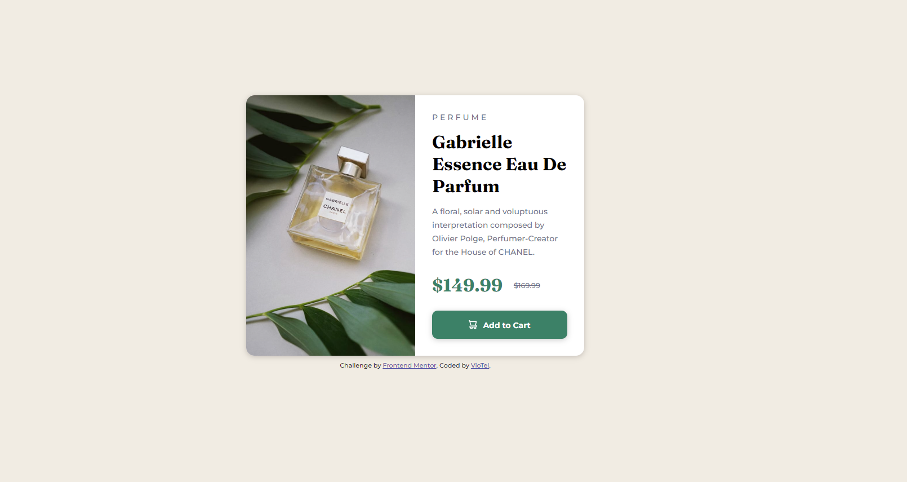

# Frontend Mentor - Product preview card component solution

This is a solution to the [Product preview card component challenge on Frontend Mentor](https://www.frontendmentor.io/challenges/product-preview-card-component-GO7UmttRfa). Frontend Mentor challenges help you improve your coding skills by building realistic projects. 

## Table of contents

- [Overview](#overview)
  - [The challenge](#the-challenge)
  - [Screenshot](#screenshot)
  - [Links](#links)
- [My process](#my-process)
  - [Built with](#built-with)
  - [What I learned](#what-i-learned)
  - [Continued development](#continued-development)
  - [Useful resources](#useful-resources)
- [Author](#author)

## Overview

### The challenge

Users should be able to:

- View the optimal layout depending on their device's screen size
- See hover and focus states for interactive elements

### Screenshot



### Links

- Solution URL: [https://github.com/viotel81/Product-Preview-Card.git]
- Live Site URL: [https://viotel81.github.io/Product-Preview-Card/]

## My process

### Built with

- Semantic HTML5 markup
- CSS custom properties
- Flexbox
- CSS Grid

### What I learned

I am particularly proud about figuring out how to manipulate images for desktop and mobile devices:

```html
<div class="card-header">
            
            
          </div>
```
```css
@media (max-width: 375px) {
.mobile {
        display: block;
        width: 100%;
        height: 100%;
        object-fit: cover;
    }
    .desktop {
        display: none;
    }   
}
```

Also, grid helped me solve the equal column width challenge in the card itself:

```css
.card {
    display: grid;
    grid-auto-flow: column;
    grid-auto-columns: 1fr;
}
```

### Useful resources

- [https://css-tricks.com/equal-columns-with-flexbox-its-more-complicated-than-you-might-think/] - A very useful, though long, article about why sometimes it is better to use Grid than Flexbox - helped me figure out 50-50 ratio for the card.
- [https://stackoverflow.com/questions/35053765/how-to-change-background-image-in-mobile] - This helped me with responsive mobile option by manipulating display: property for the images.

## Author

- Website - [Violeta](https://www.linkedin.com/in/violeta-telich-mba-84a2b435/)
- Frontend Mentor - [@viotel81](https://www.frontendmentor.io/profile/viotel81)

